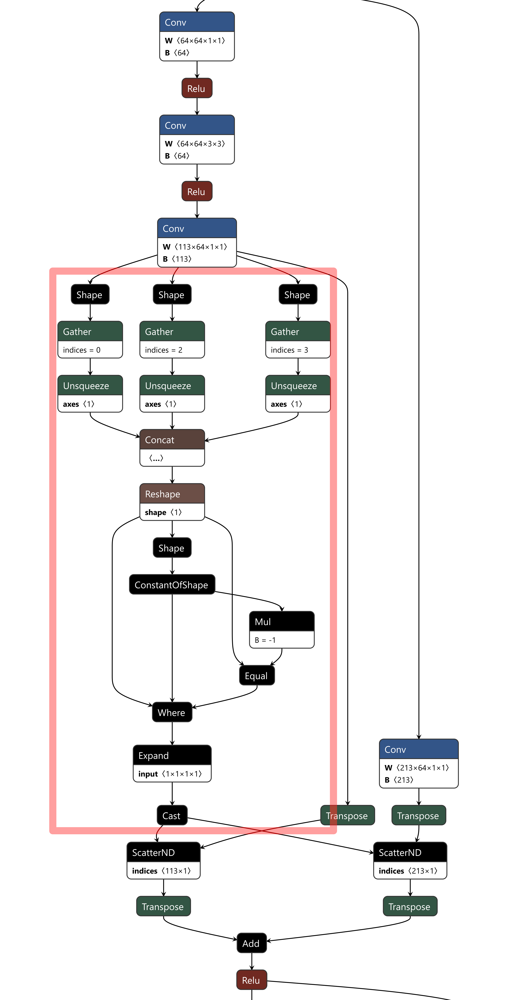

# Neural Network Shrinking

## Training

### Command

`python3 launch_experiment.py --various --arguments --among --listed --below --...`

### Arguments

* **results_path**: Where to save results  (default: './results')
    * Accepted values: any path string.

* **checkpoint_path**: Where to save models  (default: './checkpoints')
* Accepted values: any path string.

* **dataset_path**: Where to get the dataset (default: './dataset')
    * Accepted values: any path string.

* **model**: Type of model (default: 'resnet20')
    * Accepted values: 'hrnet18', 'hrnet32', 'hrnet48', 'resnet18', 'resnet34', 'resnet50', 'resnet101', 'resnet152',
      'resnet20', 'resnet32', 'resnet44', 'resnet56', 'resnet110'.

* **dataset**: dataset to use  (default: './cityscapes')
    * Accepted values: 'cityscapes', 'cifar10', 'cifar100', 'imagenet'.

* **optimizer**: Type of optimizer (default: 'sgd')
    * Accepted values: 'sgd', 'adam'.

* **scheduler**: Type of scheduler (default: 'poly')
    * Accepted values: 'poly', 'multistep'.

* **poly_exp**: Polynomial exponent of scheduler (default: 2)')
    * Accepted values: any float value.

* **lr**: Learning rate (default: 0.01)')
    * Accepted values: any float value.

* **wd**: Weight decay rate (default: 5e-4)')
    * Accepted values: any float value.

* **batch_size**: Input batch size for training (default: 1)')
    * Accepted values: any int value.

* **test_batch_size**: Input batch size for testing (default: 1)')
    * Accepted values: any int value.

* **epochs**: Number of epochs to train (default: 200)')
    * Accepted values: any int value.

* **distributed**: Distributes the model across available GPUs  (default: False).
    * Using this arguments sets the value on True.

* **debug**: Debug mode.
    * Using this arguments sets the value on True.

* **criterion**: Type of criterion (default: 'rmi')
    * Accepted values: 'rmi', 'crossentropy'.

* **metrics**: List of metrics (default: ['miou'])
    * Accepted values: 'miou', 'top1', 'top5'.

* **device**: Device to use (default: 'cuda')
    * Accepted values: any device string, such as 'cpu' or 'cuda'

* **frozen_image_shape**: Image shape for which to freeze the network at the end (default: (1, 3, 512, 1024))
    * Accepted values: any tuple of integers.

* **input_feature_maps**: Input feature maps of classification ResNets (either 64 or 16)')
    * Accepted values: any int value.

* **pretrained**: Use pretrained models.
    * Using this arguments sets the value on True.

* **pruning_rate**: Pruning rate (default: 0.)')
    * Accepted values: any float value between 0 and 1.

* **pruner_image_shape**: Image shape for the pruner's inference (default: (1, 3, 64, 64))
    * Accepted values: any tuple of integers.

* **lrr**: Applies LR-Rewinding by retraining the network after pruning.
    * Using this arguments sets the value on True.

* **pruning_criterion**: Pruning criterion (default: "global')
    * Accepted values: 'global', 'local' or 'safe"

* **pruning_method**: Pruning method (default: "swd')
    * Accepted values: 'none', 'swd' or 'liu2017"

* **pruning_iterations**: Number of iterations in which divide pruning; works only with liu2017 (default: 1)')
    * Accepted values: any int value.

* **fine_tuning_epochs**: Number of fine-tuning epochs for each pruning iteration (default: 20)')
    * Accepted values: any int value.

* **additional_final_epochs**: How many more fine-tuning epochs at the very end (default: 0)
    * Accepted values: any int value.

* **a_min**: Starting value for the a of SWD (default: 1e0)')
    * Accepted values: any float value.

* **a_max**: Final value for the a of SWD (default: 1e0)')
    * Accepted values: any float value.

* **liu2017_penalty**: Value of the smooth-L1 penalty for Liu2017 (default: 1e-6)')
    * Accepted values: any float value.

## Converting to ONNX

### Command

`python3 convert_to_onnx.py --arguments --...`

### Arguments

* **model_path**: Path to the .pt or .chk model to convert (default: '')
    * Accepted values: any path string.

* **frozen_image_shape**: Image shape for which to configure the ONNX network (default: (1, 3, 512, 1024))
    * Accepted values: any tuple of integers.

* **device**: Device to use (default: 'cuda')
    * Accepted values: any device string, such as 'cpu' or 'cuda'

## Benchmarking on Jetson

### Command

`bash run_benchmark_on_jetson.sh your arguments`

### Arguments

* $1: path to the model to benchmark
* $2: file in which to store tegrastats' output
* $3: pruning rate
* $4: input shape
* $5: duration of sleep in seconds

## ONNX Implementation

Indexation-additions are performed by scattering the value, of the tensors to sum, into two copies of a same temporary tensor.
This temporary empty tensor is instantiated within the red rectangle. Scattering is done using the ScatterNd operator; transpositions allow operating directly on channels (cf. [documentation of ScatterND](https://github.com/onnx/onnx/blob/main/docs/Changelog.md#ScatterND-13)).

